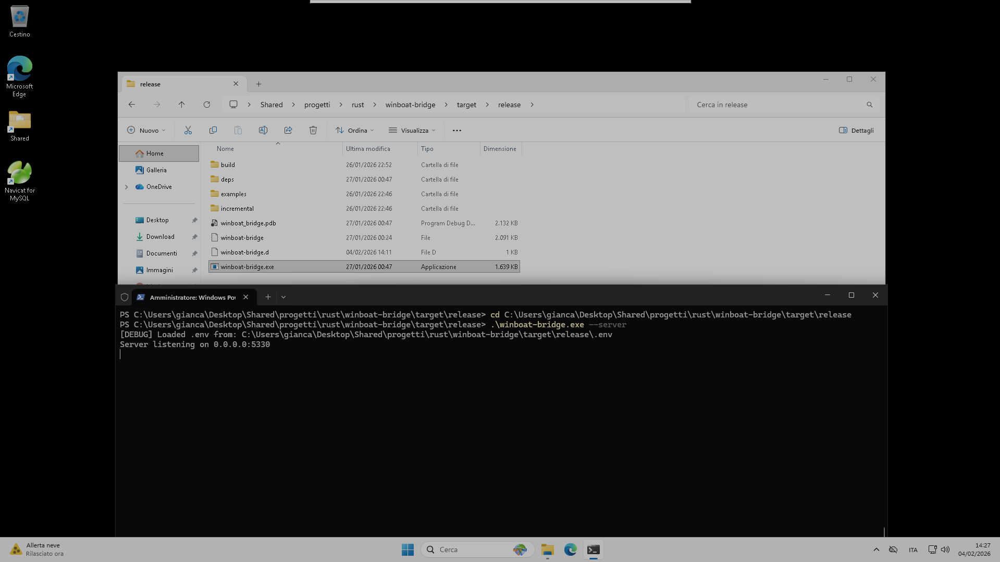

# CrossPilot – Quickstart for Binary Users

This quick guide is for people who want to download the ready-made binaries and run CrossPilot without building from source.

## 1. Check your Docker Compose ports

Make sure your running `docker-compose` exposes the right ports. Run:

```bash
cat ~/.crosspilot/docker-compose.yml
```

Confirm it includes something like:

```yaml
services:
  windows:
    ports:
      - "127.0.0.1:47320:5985"  # WinRM access
      - "127.0.0.1:47330:5330"  # CrossPilot server
```

This maps the Windows container’s port `5330` to host port `47330`, so the Linux client can reach the server.

After changing the compose file, reload the container:

```bash
cd ~/.crosspilot
docker compose restart
```

## 2. Set up the Windows server

### Option A: Auto-deploy (Recommended)

With the auto-deploy feature, you **don't need to manually copy the Windows exe**. The Linux binary embeds the Windows server exe and uploads it automatically via WinRM when the client detects it's missing or outdated on the remote host.

Just configure the `.env` with valid WinRM credentials (see step 4) and run:

```bash
crosspilot -- hostname
```

The client will:
1. Try to connect to the bridge server on the configured port
2. If the server is down, bootstrap it via WinRM
3. If the exe is missing on the remote host, auto-deploy the embedded copy
4. Start the server and execute the command

### Option B: Manual deployment

1. Download `crosspilot.exe` for Windows from the [GitHub Releases page](https://github.com/Giancarlo1974/crosspilot/releases).
2. Copy it into the shared folder used by the Windows VM, for example:

   ```text
   /home/gianca/Desktop/Shared/progetti/rust/crosspilot/target/release/crosspilot.exe
   ```

3. This exact path is what you will reference in the `.env` file later.
4. Start the Windows binary with PowerShell and `--server`, then make sure it listens on `0.0.0.0:5330` as shown in the screenshot.



## 3. Set up the Linux client

1. Download the Linux binary `crosspilot` from the same [Releases page](https://github.com/Giancarlo1974/crosspilot/releases).
   > The release binary includes the Windows server exe **embedded** — no separate download needed for auto-deploy.
2. Move it to `/usr/local/bin` or another folder already in your `PATH`.
3. Make it executable:

   ```bash
   chmod +x /usr/local/bin/crosspilot
   ```

4. Keep in mind the client uses port `47330` to talk to the server on port `5330`, so those settings must match your docker-compose mapping.

## 4. Configure `.env`

1. Open `.env` for editing:

   ```bash
   nano .env
   ```

2. Replace the values with your setup (change paths if needed):

   ```bash
   CROSSPILOT_EXE_PATH=C:\\Users\\gianca\\Desktop\\Shared\\progetti\\rust\\crosspilot\\target\\release\\crosspilot.exe
   CROSSPILOT_HOST=127.0.0.1
   CROSSPILOT_PORT=47320
   CROSSPILOT_USER=gianca
   CROSSPILOT_PASS=gianca
   CROSSPILOT_LOG_PATH=C:\\Users\\gianca\\server.log
   CROSSPILOT_ERR_PATH=C:\\Users\\gianca\\server.err
   CROSSPILOT_SERVER_PORT=5330
   CROSSPILOT_CLIENT_PORT=47330
   ```


### Multiple environments (optional)

The `.env` can hold several named host configurations using prefixed keys:
`CROSSPILOT_<NAME>_<FIELD>` (e.g. `CROSSPILOT_PROD_HOST`, `CROSSPILOT_PROD_USER`, ...).
`CROSSPILOT_ENV=<NAME>` selects the active environment; unprefixed keys act as
fallback for missing fields. Manage them directly from the tool:

```bash
crosspilot env add prod --host 10.0.0.5 --user admin --pass secret \
    --winrm-port 5985 --exe-path 'C:\tools\crosspilot.exe'
crosspilot env list            # list environments (* = active)
crosspilot env show prod       # effective config (password masked)
crosspilot env set prod --host 10.0.0.9
crosspilot env use prod        # set CROSSPILOT_ENV=PROD in .env
crosspilot env remove prod
```

You can also override the selection for a single run without editing the file:
`CROSSPILOT_ENV=staging crosspilot -- ipconfig`.

## 5. Run Windows commands from Linux

Once the client is installed, use it to run commands on the Windows side.
Everything after `--` is passed literally to `cmd.exe` on the remote host:

```bash
crosspilot -- ipconfig
```

Or run any other command, for example:

```bash
crosspilot -- dir 'C:\'
```

## 6. Support the project (aka "The Star Section" ⭐)

Building tools like this is fun, but seeing stars is better! 

If this tool saved you time or just made your life easier, please **drop a star** on this repository. It costs you $0.00, but it gives me the fuel (and the dopamine) to keep building and sharing more cool stuff for free. 

Go on, click that star. You know you want to! 😉
