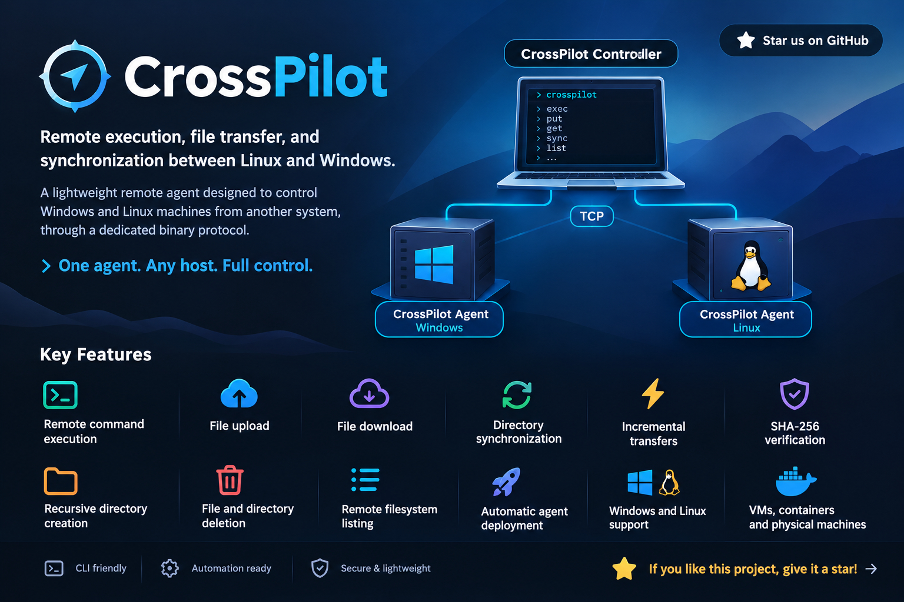

# WinBoat Bridge [](https://github.com/Giancarlo1974/winboat-bridge/stargazers)




WinBoat Bridge is an orchestration tool that allows a Linux system to run commands inside a Windows environment transparently.

It was born for [WinBoat](https://github.com/Giancarlo1974/winboat) (a virtualized Windows container), but works with **any Windows machine** reachable over the network: a local Docker container, a VM, a bare-metal server, or a remote host on your LAN.

Unlike standard solutions like SSH or WinRM (used only for bootstrap), WinBoat Bridge provides a direct and fast channel, ideal for Continuous Integration (CI) pipelines and test automation.

If you are in a hurry and want to skip building from source, check the simple quickstart at [docs/quickstart.md](docs/quickstart.md) for using the ready-made binaries.

## Features

### Remote command execution (v1)
- Run any shell/PowerShell command inside the Windows environment: `winboat-bridge -- <command>`
- The `--` form passes everything after it literally to `cmd.exe` on the remote Windows host, with no shell escaping — write commands exactly as you would on a Windows console
- Automatic server bootstrap via WinRM if the bridge server is down
- **Auto-deploy**: if the Windows server exe is missing or outdated on the remote host, the client automatically uploads the embedded copy via WinRM (no manual deployment needed)
- **Multiple environments**: the `.env` can hold N named host configs (`WINBOAT_<NAME>_*`); select the active one with `WINBOAT_ENV` and manage them with `winboat-bridge env list|show|add|set|remove|use`

### Single-file transfer with rsync-style delta (v1)
- `put` — upload a local file to the remote host (delta transfer, only changed blocks are sent)
- `get` — download a remote file to a local path (delta transfer)
- Atomic writes: each file is written to a `.part` temp file and renamed only after SHA-256 verification, so a crash never leaves a half-written destination
- Full spec: [docs/transfer-spec.md](docs/transfer-spec.md)

### Directory synchronization (v2)
One-way mirror from a Linux directory to a Windows directory, layered on top of the v1 transfer protocol. Full spec: [docs/sync-spec.md](docs/sync-spec.md).

- `status <local_dir> <remote_dir>` — read-only diff between a local and a remote directory (lists NEW / CHANGED / MISSING / IDENTICAL / CONFLICT entries)
- `sync <local_dir> <remote_dir>` — mirror the local directory onto the remote one (creates missing dirs, uploads new/changed files, optionally deletes extras)
- Recursive directory traversal
- Comparison by **size** by default; switch to **SHA-256** comparison with `--checksum` (detects corruption that size alone can't see)
- `--delete` — remove files/directories on the destination that no longer exist in the source
- `--dry-run` — show the plan without writing or deleting anything
- `--quiet` — machine-readable summary only (for CI logs)
- Sequential transfers only (no parallel server calls), reusing the atomic v1 `put` for every file
- Windows-aware safety: skips Windows-reserved names (`CON`, `PRN`, trailing `.`), detects case collisions (`a.txt` vs `A.txt`), and rejects path escapes (`..`) and symlink/junction escapes on the server side

> **Note:** the v2 directory sync requires the **Windows server to be running the same version** (with LIST/MKDIR_BATCH/DELETE_BATCH message support). A v1-only server will reject the new messages.

## 1. Configuration (.env File)

The project uses a .env file to manage paths and credentials.
Copy the example file and customize it before you start:

```bash
cp .env.example .env
```

**⚠️ IMPORTANT - .env File Syntax:**
- Use **double backslashes** (`\\`) for Windows paths in unquoted values
- Quotes are supported: `"C:\\Users\\x"` is unescaped to `C:\Users\x` (the `env` commands write quoted values automatically when needed)

Correct example:
```bash
WINBOAT_EXE_PATH=C:\\Users\\gianca\\Desktop\\Shared\\progetti\\rust\\winboat-bridge\\target\\release\\winboat-bridge.exe
WINBOAT_LOG_PATH=C:\\Users\\gianca\\server.log
```

Main parameters:
- **WINBOAT_EXE_PATH**: Absolute path (on Windows side) where the server is located
- **WINBOAT_HOST / PORT**: Address and port for bootstrap (WinRM). The same host is used by the client for the TCP bridge connection
- **WINBOAT_CLIENT_PORT**: Port on the Linux system (Host) mapped to the container
- **WINBOAT_SERVER_PORT**: Internal port of the Windows container that the server listens on
- **WINBOAT_ENV**: Active environment name (see "Multiple environments" below)

The .env file is automatically searched in:
1. Current working directory
2. Executable directory
3. Project root (if executable in `target/release`)

### Multiple environments

The `.env` can hold N named host configurations using prefixed keys `WINBOAT_<NAME>_<FIELD>` (e.g. `WINBOAT_PROD_HOST`, `WINBOAT_PROD_USER`). `WINBOAT_ENV=<NAME>` selects the active environment; unprefixed keys (the "default" environment) are the fallback for fields missing in the named env — so a named env only needs to override what differs.

Fields: `HOST`, `PORT` (WinRM), `USER`, `PASS`, `EXE_PATH`, `CLIENT_PORT`, `SERVER_PORT`, `LOG_PATH`, `ERR_PATH`, `SEGMENT_SIZE` (transfer segment bytes, 1MB–256MB).
Reserved names (they would collide with unprefixed keys): `ENV`, `SERVER`, `CLIENT`, `DEFAULT`.

Manage environments directly from the tool — no manual editing needed:

```bash
# Create an environment (at least --host is required)
winboat-bridge env add prod --host 10.0.0.5 --user admin --pass secret \
    --winrm-port 5985 --exe-path 'C:\tools\winboat-bridge.exe' \
    --client-port 5330 --server-port 5330

winboat-bridge env list            # list environments (* = active)
winboat-bridge env show prod       # effective config (password masked; --reveal to show)
winboat-bridge env set prod --host 10.0.0.9   # update fields
winboat-bridge env use prod        # set WINBOAT_ENV=PROD in .env
winboat-bridge env use default     # back to unprefixed keys
winboat-bridge env remove prod
```

One-off override without editing the file (shell env vars take precedence over .env):

```bash
WINBOAT_ENV=staging winboat-bridge -- ipconfig
```

## 2. Compilation

The project generates a single binary. It must be compiled for Windows (Server) and Linux (Client).
Both targets can be built as **statically-linked binaries** (no runtime DLL/shared-library dependencies), which is the recommended approach for deployment to containers and clean hosts.

### A. Build release with embedded Windows exe (Recommended)

The Linux client binary embeds the Windows server exe (`include_bytes!`) so that it can auto-deploy the server on any remote Windows host via WinRM — no need to manually copy the exe or have the source tree on the client machine.

Use the dedicated build script:

```bash
./scripts/build-release.sh           # release (optimized)
./scripts/build-release.sh --debug   # debug build
```

The script:
1. Cross-compiles the Windows exe (`x86_64-pc-windows-gnu`)
2. Copies it to `assets/winboat-bridge.exe`
3. Compiles the Linux binary (embeds the exe via `include_bytes!`)

The result is a single self-contained Linux binary (`target/release/winboat-bridge`) that can be distributed to any Linux machine. When the client detects that the remote exe is missing or outdated, it uploads the embedded copy automatically.

**Requirements:**
- Rust target: `rustup target add x86_64-pc-windows-gnu`
- MinGW cross-compiler: `x86_64-w64-mingw32-gcc` in PATH
- On NixOS: `nix-shell -p rustc cargo pkgsCross.mingwW64.buildPackages.gcc`

> **Important:** Always use `build-release.sh` for releases. Running `cargo build` alone will either fail (if `assets/winboat-bridge.exe` is missing) or embed a stale copy.

### B. Build for Windows only (Server) — manual

If you only need the Windows server exe (e.g. for manual deployment without auto-deploy):

#### Option 1: Cross-compilation from Linux

```bash
cargo build --release --target x86_64-pc-windows-gnu --bin winboat-bridge
```

The executable is produced at:
```
target/x86_64-pc-windows-gnu/release/winboat-bridge.exe
```

#### Option 2: Native compilation on Windows

If you have direct access to a Windows system with Rust installed:
1. Open a PowerShell in the project root.
2. Run a static release build:
   ```powershell
   $env:RUSTFLAGS = "-C target-feature=+crt-static"
   cargo build --release
   ```
3. You'll find the file in `target\release\winboat-bridge.exe`.

Make sure the file is in the shared folder and that the path in .env (WINBOAT_EXE_PATH) points correctly to this binary.

### C. Build for Linux only (Client) — without embed

For development/testing without the Windows embed (the auto-deploy will fail if the remote exe is missing):

```bash
cargo build --release
```

#### Static (recommended for deployment to containers / clean hosts)

A fully static Linux binary (no glibc dependency) is built with the `musl` target and `+crt-static`. This is the best option when the client must run on a minimal/Alpine container or a host with a different libc version.

```bash
# 1. Add the musl target (one-time)
rustup target add x86_64-unknown-linux-musl

# 2. Build static release
RUSTFLAGS="-C target-feature=+crt-static" cargo build --release --target x86_64-unknown-linux-musl
```

The static executable is produced at:
```
target/x86_64-unknown-linux-musl/release/winboat-bridge
```

Verify it's truly static:
```bash
ldd target/x86_64-unknown-linux-musl/release/winboat-bridge
# => "not a dynamic executable" (statically linked)
```

> **NixOS note:** on NixOS the toolchain isn't on `PATH` by default. Wrap any `cargo` invocation in a nix-shell, e.g.:
> ```bash
> nix-shell -p rustc cargo --run "cargo build --release"
> ```
> For the musl static build on NixOS, use the musl-providing shell and set `RUSTFLAGS` as above.

## 3. Global Installation (Linux)

Once you have compiled the Linux client, copy the resulting binary into
`~/.local/bin` so that the executable stays available even if you delete or move the repository later.

```bash
# Create the directory if it doesn't exist
mkdir -p ~/.local/bin

# Remove any stale symlink left over from previous attempts
rm -f ~/.local/bin/winboat-bridge

# Copy the freshly built binary into place with the correct permissions.
# Use the static musl binary if you built one (recommended), otherwise the glibc one:
install -Dm755 target/x86_64-unknown-linux-musl/release/winboat-bridge ~/.local/bin/winboat-bridge
#   or: install -Dm755 target/release/winboat-bridge ~/.local/bin/winboat-bridge
```

This guarantees `/home/gianca/.local/bin/winboat-bridge` is a real executable and avoids "required file not found"
errors when the project directory disappears. Make sure `~/.local/bin` is in your `$PATH` (check `~/.bashrc` or `~/.zshrc`).

## 4. Docker Compose Integration

Configure port mapping in your docker-compose.yml to expose the necessary services:

```yaml
services:
  windows:
    ports:
      - "127.0.0.1:47320:5985"  # WinRM (For automatic bootstrap)
      - "127.0.0.1:47330:5330"  # WinBoat Bridge (Client-Server communication)
```

## 5. Usage Examples

Once the .env file is configured, the Linux client will handle everything automatically (including starting the Windows server if it's off).

### A. Local WinBoat container (default)

Default configuration points to a local Docker-mapped WinBoat container (`127.0.0.1`):

```bash
winboat-bridge -- ipconfig
```

Run a PowerShell script inside the container:

```bash
winboat-bridge -- powershell -File C:\Scripts\Setup-Test.ps1
```

### B. Remote Windows host

Point `WINBOAT_HOST` to the remote machine and `WINBOAT_CLIENT_PORT` to the port the bridge server is listening on. Both the bootstrap (WinRM) and the TCP data channel use the same host, only the ports differ.

> **Tip:** instead of overwriting the default values, you can keep multiple hosts side by side with named environments — `winboat-bridge env add remote --host 172.16.0.101 ...` then `winboat-bridge env use remote`. See "Multiple environments" in section 1.

`.env` for a remote host at `172.16.0.101`:

```bash
WINBOAT_HOST=172.16.0.101
WINBOAT_PORT=5985              # WinRM port on the remote host (for bootstrap)
WINBOAT_CLIENT_PORT=5330       # TCP bridge port on the remote host
```

Verify the connection to the remote host:

```bash
winboat-bridge -- hostname
```

Run a command on the remote Windows machine:

```bash
winboat-bridge -- dir 'C:\Users'
```

Run a PowerShell script remotely:

```bash
winboat-bridge -- powershell -File C:\Scripts\Setup-Test.ps1
```

> **Note:** If the bridge server is already running on the remote host, the client connects directly. If it's down, the client will try to bootstrap it via WinRM using `WINBOAT_HOST`/`WINBOAT_PORT`/`WINBOAT_USER`/`WINBOAT_PASS` — make sure those credentials are valid for the remote machine.

### C. Directory diff (status) — read-only

Preview what a sync would do, without touching the remote directory. Useful before running `sync` or in CI to detect drift.

```bash
# Basic diff (compare by file size)
winboat-bridge status ./artifacts C:\ci\artifacts
```

Sample output:
```
NEW       app.exe
NEW       lib/core.dll
CHANGED   config.json
MISSING   old_log.txt
IDENTICAL README.md
[status] 2 new, 1 changed, 1 missing, 1 identical, 0 conflict
```

Compare by SHA-256 instead of size (slower but catches silent corruption — same size, different bytes):
```bash
winboat-bridge status ./artifacts C:\ci\artifacts --checksum
```

Machine-readable summary only (no per-entry lines, ideal for CI logs):
```bash
winboat-bridge status ./artifacts C:\ci\artifacts --quiet
# [status] new=2 changed=1 missing=1 identical=1 conflict=0
```

Exit codes: `0` even when differences exist (it's read-only), `1` on operational errors, `2` for an invalid local path.

### D. Directory mirror (sync) — one-way upload

Mirror a local Linux directory onto a remote Windows directory. Missing destination directories are created automatically; each file is uploaded with the atomic v1 `put` (delta + SHA-256 verify + rename).

```bash
# Mirror: upload new/changed files, create missing dirs
winboat-bridge sync ./artifacts C:\ci\artifacts
```

Mirror and also delete anything on the destination that no longer exists in the source (true mirror):
```bash
winboat-bridge sync ./artifacts C:\ci\artifacts --delete
```

Preview the plan without writing or deleting anything:
```bash
winboat-bridge sync ./artifacts C:\ci\artifacts --delete --dry-run
```

Sample `--dry-run` output:
```
PUT       app.exe
PUT       lib/core.dll
SKIP      README.md (identical)
DELETE    old_log.txt
[sync] completato: 0 trasferiti (0 byte totali, delta 0 byte), 0 cancellati, 0 saltati, 0 errori, 0.0s
```

Summary-only mode for CI:
```bash
winboat-bridge sync ./artifacts C:\ci\artifacts --delete --quiet
# [sync] put=2 delete=1 skip=1 errors=0 bytes=524288 delta=4096 time=1.2s
```

Exit codes: `0` if all operations succeed, `1` if at least one file failed (sync still completes all remaining files and reports partial failures), `2` for an invalid local path.

### E. Typical CI workflow

A common CI pattern: build artifacts locally, mirror them to the Windows host, run the Windows test suite, then pull back the logs.

```bash
# 1. (Linux) produce build artifacts under ./artifacts
# 2. Mirror artifacts to the Windows container (delete stale files)
winboat-bridge sync ./artifacts C:\ci\artifacts --delete

# 3. Run the Windows test suite
winboat-bridge -- C:\ci\run_tests.bat

# 4. Pull back the test logs
winboat-bridge get  C:\ci\artifacts\test-results.log ./test-results.log

# 5. (optional) verify the remote dir matches the source
winboat-bridge status ./artifacts C:\ci\artifacts --quiet
```

## 6. Support the project (aka "The Star Section" ⭐)

Building tools like this is fun, but seeing stars is better! 

If this tool saved you time or just made your life easier, please **drop a star** on this repository. It costs you $0.00, but it gives me the fuel (and the dopamine) to keep building and sharing more cool stuff for free. 

Go on, click that star. You know you want to! 😉

## Troubleshooting

| Problem              | Possible Cause          | Solution |
|-----------------------|--------------------------|-----------|
| The command "hangs" | Zombie connection       | Ctrl+C and restart; the client will force a new bootstrap. |
| Connection Refused    | Wrong port mapping     | Check with `docker ps` that port 47330 is open (local) or `nc -zv <host> 5330` (remote). |
| "WINBOAT_EXE_PATH (o WINBOAT_<ENV>_EXE_PATH) must be set" | .env file not found, wrong syntax, or the active env doesn't define `EXE_PATH` | Verify that the .env file exists and check `winboat-bridge env show <name>` to see which fields are resolved. Run with `--help` to see the message `[DEBUG] Loaded .env from: ...` |
| .env parsing error   | Wrong syntax          | Use double backslashes (`\\`) for Windows paths in unquoted values (quoted values are supported and unescaped). |
| Bootstrap succeeds but client still can't connect | `WINBOAT_EXE_PATH` points to a non-existent file on the remote host | The client auto-deploys the embedded exe if missing. If auto-deploy fails, check WinRM connectivity and that the target directory is writable. Run `Test-Path "<path>"` on the remote host to verify. |
| Auto-deploy fails with "Binario locale non trovato" | The Linux binary was built without `build-release.sh` (no embedded exe) | Rebuild with `./scripts/build-release.sh` to embed the Windows exe. |
| Bootstrap fails with "Connection refused" | WinRM not enabled on the remote host | Run `Enable-PSRemoting -Force` on the remote Windows host and open port 5985 in the firewall (`Set-NetFirewallRule -Name "WINRM-HTTP-In-TCP" -RemoteAddress Any`). |
| Bootstrap fails with auth error | Wrong user/domain format | Use the UPN format `user@domain` in `WINBOAT_USER` (e.g. `user@domain.com`). Avoid `DOMAIN\user` (backslash escaping issues in .env). |
| Wrong .env loaded (points to `127.0.0.1`) | A stale `.env` exists in `target/release/` and takes precedence | Check the `[DEBUG] Loaded .env from: ...` line. If it points to `target/release/.env`, update that file too (or remove it to fall back to the project root `.env`). |
| `WINBOAT_CLIENT_PORT` mismatch on remote host | Remote host doesn't use Docker port mapping | Set `WINBOAT_CLIENT_PORT` to the actual port the server listens on (default `5330`), not the Docker-mapped `47330`. |
| `status`/`sync` fail with a protocol error | The Windows server is running an old v1-only build that doesn't understand the LIST/MKDIR/DELETE messages | Rebuild and redeploy the Windows server with the current version (`./build_windows.sh`), then restart it. The v2 directory sync requires server and client to be on the same version. |
| `sync` reports `CONFLICT` entries | A local file collides with a remote directory at the same relative path, or two local files differ only by case (`a.txt` vs `A.txt`) | Conflicts are skipped to avoid data loss. Remove or rename the offending entry on either side, then re-run `sync`. |

### .env Loading Debug

To verify that the .env file is loaded correctly, run:

```bash
./target/release/winboat-bridge --help 2>&1 | grep DEBUG
```

You should see:
```
[DEBUG] Loaded .env from: /path/to/.env
```

If you see `[WARNING] No .env file found`, check that:
1. The .env file exists in the current directory, executable directory, or project root
2. The syntax is correct (double backslashes, no quotes)
3. The file has correct read permissions
